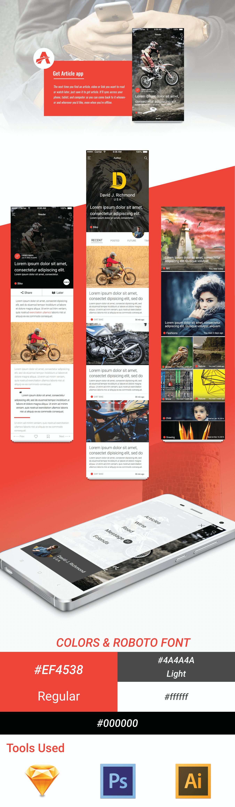

# muthucreation.github.io
my personal web

Create popup for works 

Copy paste the below code

<h3>HTML</h3>

    

    		

    			<a class="close-modal">X</a>	
    				

    					<h3 class="work-detail">Reader App Design</h3>
    					
    				

    		

    

Change the id of the modal to work-2-modal likewise

<h3>JS</h3>
    			
	$("#work-1").click(function(){
		$("#work-1-modal").css("display","block");
	});
	
make sure #work-'number' and #work-'number'-modal are added correctly in links and modal
